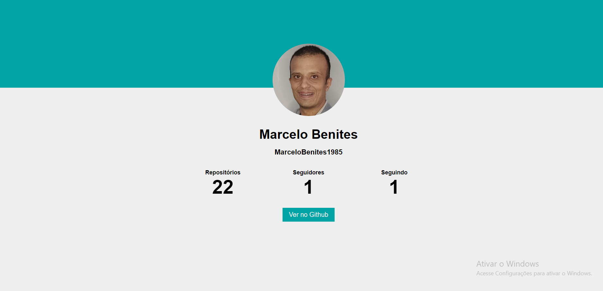

# EBAC | Projeto Github

Este projeto foi feito com a interface do javascript fetch do Ajax , o objetivo  deste projeto é mostrar ao usuario o repositório , o numero de seguidores e o numero de pessoas que eu sigo todas essas informações é buscada e mostrada através da API .

## 📚 Documentação

- [API do Github](https://api.github.com)
- [Domentação do Fetch](https://developer.mozilla.org/pt-BR/docs/Web/API/Fetch_API/Using_Fetch)

### Stack utilizada

**Front-end:** HTML5, JavaScript, CSS3

